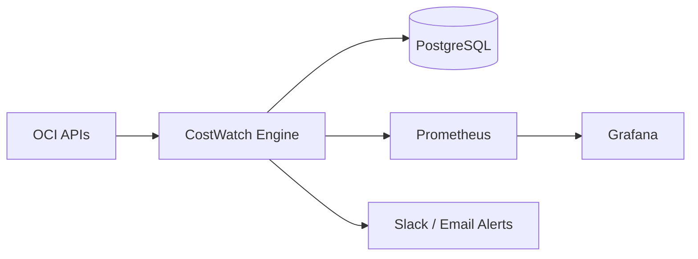

# OCI CostWatch


OCI CostWatch is an open-source DevOps + FinOps platform for **Oracle Cloud Infrastructure (OCI)** that monitors cost usage, identifies zombie/idle resources, detects unsafe internet exposure, validates tag compliance, and delivers optimization recommendations.

## Project Overview

- FastAPI API and CLI for day-2 operations
- Modular scanner engine (cost, exposure, zombie, idle, storage waste, network waste, tag compliance)
- PostgreSQL persistence with Alembic migration scaffold
- Celery + Redis periodic scheduler
- Prometheus metrics and Grafana dashboards
- Slack + SMTP alerting integrations
- Demo mode for local run without OCI credentials

## Architecture Diagram



## Architecture (Code Layers)

- `backend/api`: FastAPI routes
- `backend/services`: business orchestration
- `backend/scanners`: OCI and heuristics scan logic
- `backend/models`: SQLAlchemy models
- `backend/repositories`: DB query/write layer
- `backend/alerts`: notification providers

## Installation

```bash
git clone <your-fork-or-repo-url>
cd OCI-CostWatch
cp .env.example .env
docker compose up --build
```

Services:
- API docs: http://localhost:8000/docs
- Prometheus: http://localhost:9090
- Grafana: http://localhost:3000

## Configuration

All config is controlled by environment variables via Pydantic settings (`backend/config/settings.py`).

Key values in `.env.example`:
- OCI profile and config path (`OCI_CONFIG_FILE`, `OCI_PROFILE`)
- `DATABASE_URL`, `REDIS_URL`
- scan intervals (`SCAN_INTERVAL_*`)
- thresholds (`COST_SPIKE_THRESHOLD_PCT`, `IDLE_CPU_THRESHOLD_PCT`)
- governance (`MANDATORY_TAGS`)
- `DEMO_MODE`

## Connect to OCI Credentials

OCI CostWatch uses the OCI CLI config file at `~/.oci/config`.

1. Install + configure OCI CLI:
   ```bash
   oci setup config
   ```
2. Ensure `.env` includes:
   ```env
   OCI_CONFIG_FILE=~/.oci/config
   OCI_PROFILE=DEFAULT
   OCI_REGION=us-ashburn-1
   OCI_COMPARTMENT_ID=<your-compartment-ocid>
   ```
3. Mount your `~/.oci` folder to containers when running in Docker (via compose override if needed).

## CLI Examples

```bash
costwatch scan
costwatch report
costwatch exposures
costwatch zombies
costwatch recommendations
costwatch dashboard
```

## API Endpoints

- `POST /scan` : full scan
- `GET /cost` : cost summary + spike detection
- `GET /resources` : zombie + idle resources
- `GET /zombies` : persisted zombie resources
- `GET /exposures` : persisted exposure findings
- `GET /tags` : mandatory tag compliance findings
- `GET /recommendations` : persisted recommendations
- `GET /scan-history` : scan execution history

## Grafana Dashboard

Import `dashboards/grafana_dashboard.json` to get panels for:
- Daily cost trend
- Monthly projected cost
- Zombie resources
- Public internet exposures
- Idle instances
- Cloud hygiene score

## Demo Data Mode

Set `DEMO_MODE=true` to run locally without OCI credentials. Scanners provide synthetic-but-realistic findings for development, demos, and UI validation.

## CI/CD

GitHub Actions (`.github/workflows/ci.yml`) runs:
- Ruff lint
- Flake8 lint
- Black format check
- Pytest
- Docker image build
- Trivy vulnerability scan
- Gitleaks secrets scan

## Security Notes

- No credentials hard-coded.
- OCI auth expected from `~/.oci/config`.
- Backend Docker container runs as non-root user.

## Contributing

See [CONTRIBUTING.md](CONTRIBUTING.md).
