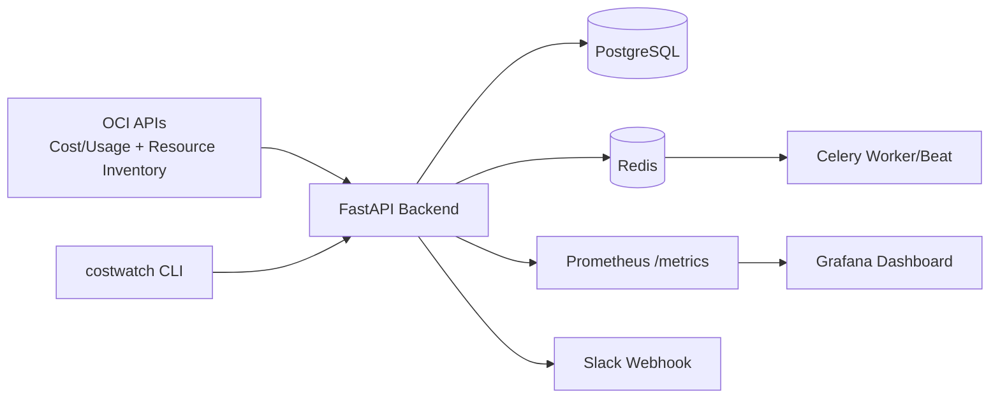

# OCI CostWatch

OCI CostWatch is an open-source DevOps + FinOps platform for **Oracle Cloud Infrastructure (OCI)** that continuously monitors cloud costs, detects waste (zombie/idle resources), identifies internet exposure risks, and generates actionable optimization recommendations.

## Features

- **FinOps Cost Monitoring**
  - Daily and monthly cost tracking
  - Service-wise breakdown
  - Monthly cost projection
  - Cost spike detection (> configurable threshold)
- **Zombie Resource Detection**
  - Detached volumes
  - Unused public IPs
  - Old snapshots
  - Extendable detector architecture
- **Internet Exposure Scanner**
  - Security lists open to `0.0.0.0/0`
  - NSGs exposing SSH/RDP
  - Public-facing resources checks
- **Idle Resource Detection**
  - Low CPU + low network + long uptime heuristics
- **Cloud Hygiene Score (0-100)**
- **Recommendations Engine**
- **Alerts**
  - Slack webhook
  - SMTP email (optional)
- **Operational Interfaces**
  - FastAPI REST API
  - CLI (`costwatch`)
  - Prometheus metrics + Grafana dashboard
  - Celery periodic scans

## Architecture Diagram



## Repository Layout

```text
oci-costwatch/
├── backend/
├── cli/
├── terraform/
├── docker/
├── dashboards/
├── prometheus/
├── .github/workflows/
├── scripts/
└── README.md
```

## Quick Start (Local)

### 1) Clone and configure

```bash
git clone <your-fork-or-repo-url>
cd oci-costwatch
cp .env.example .env
```

### 2) Start the stack

```bash
        codex/build-oci-costwatch-open-source-project-j4conn
docker compose up --build
=======
docker compose -f docker/docker-compose.yml up --build
        main
```

### 3) Access services

- API: http://localhost:8000/docs
- Prometheus: http://localhost:9090
- Grafana: http://localhost:3000 (`admin/admin`)

## OCI Account Configuration

OCI CostWatch reads OCI credentials from your OCI CLI config (default `~/.oci/config`).

1. Install OCI CLI:
   ```bash
   bash -c "$(curl -L https://raw.githubusercontent.com/oracle/oci-cli/master/scripts/install/install.sh)"
   ```
2. Configure profile:
   ```bash
   oci setup config
   ```
3. Ensure `.env` points to that profile:
   ```env
   OCI_CONFIG_FILE=~/.oci/config
   OCI_PROFILE=DEFAULT
   OCI_REGION=us-ashburn-1
   OCI_COMPARTMENT_ID=<your-compartment-ocid>
   ```
4. Mount `~/.oci` into backend container if needed (via compose override or bind mount).

## Environment Variables

See `.env.example` for all values. Key variables:

- `DATABASE_URL`
- `REDIS_URL`
- `OCI_CONFIG_FILE`
- `OCI_PROFILE`
- `OCI_REGION`
- `OCI_COMPARTMENT_ID`
- `COST_SPIKE_THRESHOLD_PCT`
- `IDLE_CPU_THRESHOLD_PCT`
- `SLACK_WEBHOOK_URL`

## API Endpoints

- `POST /scan` - full security + waste scan
- `GET /cost` - cost analytics summary
- `GET /resources` - zombie + idle resources
- `GET /exposures` - public exposure findings
- `GET /recommendations` - optimization actions

## CLI Usage

```bash
costwatch scan
costwatch report
costwatch alerts
costwatch dashboard
```

## Terraform (Optional OCI Deployment)

```bash
cd terraform
terraform init
terraform plan -var-file=terraform.tfvars
terraform apply -var-file=terraform.tfvars
```

This provisions:
- VCN
- Subnet
- Network Security Group
- Monitoring compute instance (Docker host)

## Grafana Dashboard

Import `dashboards/grafana_dashboard.json` into Grafana.

Suggested panels:
- Daily cost trend
- Monthly projection
- Zombie resources
- Public exposures
- Idle resources

## CI/CD

GitHub Actions workflow (`.github/workflows/ci.yml`) runs:
- Ruff linting
- Pytest unit tests
- Docker image build
- Dependency security scan (`pip-audit`)

## Production Notes

- Replace synthetic scanner payloads with tenancy-specific OCI SDK logic where placeholders are marked.
- Add IAM dynamic groups/policies for read-only cost and inventory APIs.
- Store secrets in OCI Vault or GitHub Actions encrypted secrets.
- Add migration tooling (Alembic) and retention policies for historical data.
